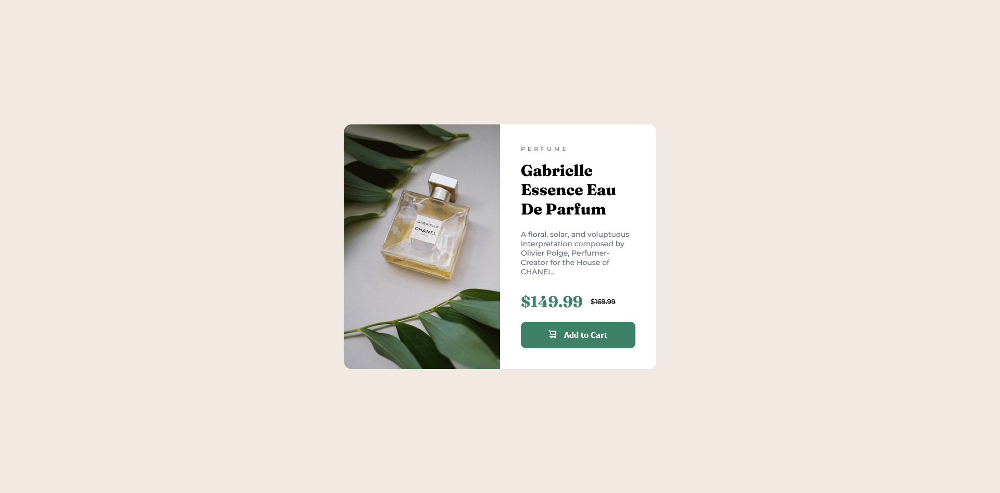

# Frontend Mentor - Product preview card component solution

This is a solution to the [Product preview card component challenge on Frontend Mentor](https://www.frontendmentor.io/challenges/product-preview-card-component-GO7UmttRfa). Frontend Mentor challenges help you improve your coding skills by building realistic projects. 

## Table of contents

- [Frontend Mentor - Product preview card component solution](#frontend-mentor---product-preview-card-component-solution)
  - [Table of contents](#table-of-contents)
  - [Overview](#overview)
    - [The challenge](#the-challenge)
    - [Screenshot](#screenshot)
    - [Links](#links)
  - [My process](#my-process)
    - [Built with](#built-with)
    - [What I learned](#what-i-learned)
    - [Continued development](#continued-development)
  - [Author](#author)

**Note: Delete this note and update the table of contents based on what sections you keep.**

## Overview

### The challenge

Users should be able to:

- View the optimal layout depending on their device's screen size
- See hover and focus states for interactive elements

### Screenshot



### Links

- Solution URL: [My solution URL](https://github.com/SamoPinter/product-preview-card-component-main)
- Live Site URL: [My live site URL](https://samopinter.github.io/product-preview-card-component-main/)

## My process

### Built with

- Semantic HTML5 markup
- CSS custom properties
- Flexbox

**Note: These are just examples. Delete this note and replace the list above with your own choices**

### What I learned

I'm improving my css structure. For example the card with nesting. 


```css
.card {
    display: flex;
    flex-direction: column;
    justify-content: center;
    text-align: left;
    max-width: 33rem;
    margin-inline: auto;
    background-color: var(--color-white);
    border-radius: 1.5rem;
    overflow: hidden;
  
   
    @media (min-width: 1440px) {
      flex-direction: row;
      max-width: 60rem;
    }
  
    &__image {
      width: 100%;
      object-fit: cover;
      height: auto;
      display: block; /* Ensure it doesn't shrink */
  
      @media (min-width: 1440px) {
        content: url('./images/image-product-desktop.jpg');
        width: 50%; /* Set 50% width for desktop */
      }
    }
}
```

### Continued development

I'm also in the process of completing Conquering responsive layouts by Kevin Powell.


## Author

- Frontend Mentor - [@SamoPinter](https://www.frontendmentor.io/profile/SamoPinter)
